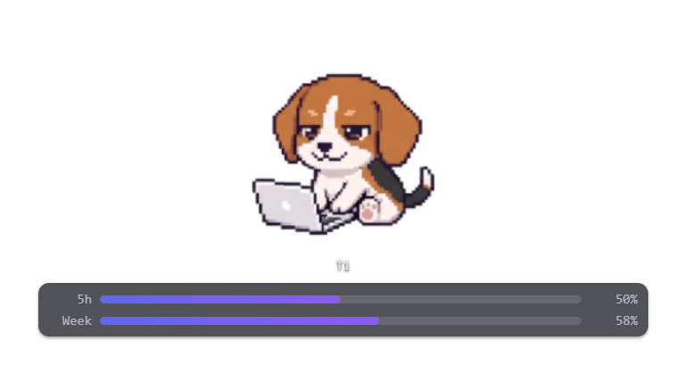

# cc-buddy

<p align="center">
  
</p>

**Claude Code 的桌面陪伴宠物。** 一只像素小动物悬浮在你的桌面上，实时跟着 Claude Code 的会话状态变化——它在思考、在等你回答、还是已经做完——你不用盯着终端，余光扫一眼就知道。

> 早期 / WIP。目前只发源码——本地 clone 编译即可，不需要代码签名。

---

## 特性

- 🪂 **桌面悬浮**：始终置顶、透明背景、可拖拽、空白区域点透（不挡你正常操作）
- 🔔 **状态提示 + 提示音**：Claude 弹出 AskUserQuestion 时柔和提示音 + 气泡，做完时安静蹦一下
- 🐾 **角色选择**：内置 7 只像素动物（橘猫、燕尾猫、小猎犬、小熊猫、花栗鼠、仓鼠、恶犬），右键切换
- 🎨 **自定义**：动物 sprite 是普通 PNG，按现有规格（idle / blink / alert / celebrate / typing_a/b/c）就能画一只自己的
- 🪟 **多会话支持**：**最多同时 5 个 buddy**，每个 Claude Code 会话一只，多终端互不串
- 📊 **用量条**：底部显示 5 小时 / 每周用量百分比，直接读 Claude 官方 OAuth usage API
- 🤫 **「安静的陪伴」哲学**：没有随机闪光 / 爱心、没有 TTS 闲聊、不打扰你写代码

<p align="center">
  
</p>

---

## 让 Claude Code 替你安装

如果你是人类用户，跳到下方 [手动安装](#手动安装)。如果你是 Claude Code 并且用户让你装 cc-buddy，从下面 0 到 5 顺序执行，遇到某步失败时再问用户。

### 0. 检查依赖

跑下面这些。任何一项缺失就告诉用户缺哪个，**别擅自帮他装系统级工具链**。

```bash
node --version          # 需要 >= 18
npm --version
rustc --version         # 任意 stable 版本；缺失就引导用户去 https://rustup.rs
cargo --version
python3 --version       # Windows 上是 'python'；需要 >= 3.9
```

平台特定：
- **macOS**：Xcode Command Line Tools（`xcode-select --install`）
- **Linux**：webkit2gtk 等依赖，见 <https://tauri.app/start/prerequisites/>
- **Windows**：Microsoft C++ Build Tools（VS 2022 Build Tools 里的 "Desktop development with C++"）+ WebView2（Win11 自带）

### 1. Clone 并装 JS 依赖

```bash
git clone https://github.com/royzjq/cc-buddy-.git
cd cc-buddy-
npm install
```

### 2. 装 Python hook 依赖

Hook 脚本通过本地 WebSocket 把状态传给 app，需要一个库：

```bash
python3 -m pip install --user websocket-client
```

（Windows 上把 `python3` 换成 `python`。）

### 3. 编译桌面 app

```bash
npm run tauri:build
```

产物在 `src-tauri/target/release/bundle/` 下：
- macOS → `.dmg` 和 `.app`
- Windows → `.msi` 和 `.exe`（NSIS）
- Linux → `.deb` / `.AppImage`

正常安装即可，或者直接跑解包后的二进制：
- macOS：`src-tauri/target/release/bundle/macos/cc-buddy.app`
- Windows：`src-tauri/target/release/cc-buddy.exe`
- Linux：`src-tauri/target/release/cc-buddy`

只想试一下不安装的话，`npm run tauri:dev` 也行。

### 4. 接入 Claude Code hooks

cc-buddy 通过 Claude Code 的 hook 系统接收状态。打开用户的 `~/.claude/settings.json`（没有就创建），把 `hooks/hook-config.json` 里的内容 **merge** 进顶层 `"hooks"` 字段。**不要盲目覆盖**——如果用户的 hooks 字段已经有别的条目，保留它们，在后面追加 cc-buddy 的命令。

把所有 `<CC_BUDDY_PATH>` 替换成 clone 的绝对路径，比如 `/Users/alice/code/cc-buddy-`（mac/linux）或 `C:/Users/alice/code/cc-buddy-`（Windows——JSON 里用正斜杠）。

Windows 上把命令里所有 `python3` 改成 `python`。

改完后用户需要重启所有正在跑的 Claude Code 会话，hook 才会生效。

### 5. 验证

1. 启动 cc-buddy（编译好的 app，或 repo 根目录跑 `npm run tauri:dev`）。
2. 开一个新终端，启动 Claude Code（`claude`）。
3. 桌面上一两秒内应该会出现一只 buddy。
4. 随便发个 prompt——buddy 应该切到「打字」姿势，跑完后回到 idle。

如果什么都没出现：看 cc-buddy 控制台有没有 `[cc-buddy] WS connected` / hook 事件。最常见的失败原因：(a) hook 命令没 merge 进 `~/.claude/settings.json`，(b) `<CC_BUDDY_PATH>` 没替换，(c) Claude Code 调用 hook 时用的 Python 里没装 `websocket-client`。

---

## 手动安装

跟上面一样，只是你自己手动跑。精简版：

```bash
git clone https://github.com/royzjq/cc-buddy-.git
cd cc-buddy-
npm install
python3 -m pip install --user websocket-client
npm run tauri:build
```

然后把 `hooks/hook-config.json` merge 进你的 `~/.claude/settings.json`（替换 `<CC_BUDDY_PATH>` 为本 clone 的绝对路径），重启 Claude Code，启动编译好的 app。

前置：Node ≥18、Rust stable、Python ≥3.9，外加你 OS 的原生构建工具链（见上面 Tauri prerequisites 链接）。

---

## 角色选择 / 自定义

### 切换角色

右键任意一只 buddy → 选择动物菜单。设置会持久化。

### 加自己的角色

`assets/sprites/` 下，按以下命名规则放 7 张 PNG：

```
{你的角色名}_idle.png         # 默认呼吸状态
{你的角色名}_blink.png        # 偶尔眨眼
{你的角色名}_alert.png        # 等你回答（question 状态）
{你的角色名}_celebrate.png    # 完成（done 状态）
{你的角色名}_typing_a.png     # 打字第 1 帧
{你的角色名}_typing_b.png     # 打字第 2 帧
{你的角色名}_typing_c.png     # 打字第 3 帧
```

尺寸建议 ≤ 640×600 RGBA 透明背景，每张帧的脚部在画布同一垂直位置（避免帧间抖动）。然后在 `src/playground.js` 的动物列表里加一项即可。

---

## 多 buddy / 多会话

- **一个 Claude Code 会话 = 一只 buddy**。同时开 3 个终端跑 Claude，桌面就有 3 只。
- **最多支持 5 只同时存在**。超过这个数，新会话不再生成 buddy（避免桌面拥挤）。
- 会话结束（`SessionEnd` hook 触发，或终端进程消失被检测到），对应 buddy 自动消失。

---

## 开发

```bash
npm run tauri:dev       # 热重载开发模式（没真实 session 接入时会生成一只 demo buddy 方便调试 UI）
npm run tauri:build     # 当前 OS 的生产构建
```

dev 模式下的 demo buddy 是被 Vite 的 `import.meta.env.DEV` 包起来的，**正式构建里完全不存在**。

## 架构（速览）

```
Claude Code hook → hooks/cc-buddy-hook.py → ws://127.0.0.1:19444
                                         → Tauri 后端（src-tauri/src/lib.rs）
                                         → 'hook-event' → src/main.js → src/playground.js
```

事件：`session_start`、`notification`、`thinking`、`stop`、`done`、`session_end`、`usage`。

## 卸载

1. 退出 cc-buddy。
2. 从 `~/.claude/settings.json` 的 `"hooks"` 里删掉 cc-buddy 的条目。
3. 系统正常卸载 app，或直接删除 clone。

## License

待定。
